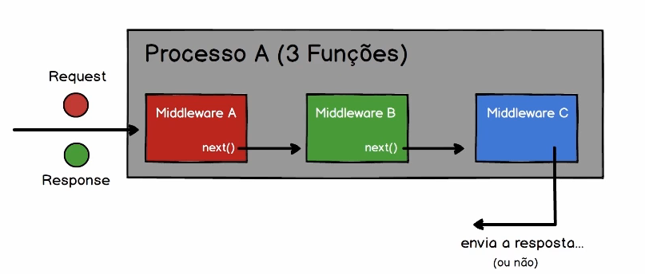

# Índice

- [Índice](#índice)
- [Sistema de Módulos](#sistema-de-módulos)
- [Usando Módulos de Terceiros](#usando-módulos-de-terceiros)
- [Sistema de Módulos: Require](#sistema-de-módulos-require)
- [Sistema de Módulos: Exports](#sistema-de-módulos-exports)
- [Arquivo `package.json`](#arquivo-packagejson)
- [Resolvendo Desafio](#resolvendo-desafio)
- [Instância Única vs Nova Instância](#instância-única-vs-nova-instância)
- [Objeto Global do Node](#objeto-global-do-node)
- [Entendendo o 'this'](#entendendo-o-this)
- [Passando Parâmetros entre Módulos](#passando-parâmetros-entre-módulos)
- [Instalando Deps e Scripts](#instalando-deps-e-scripts)
- [Lendo arquivos](#lendo-arquivos)
- [Escrevendo arquivos](#escrevendo-arquivos)
- [Padrão Middleware #01](#padrão-middleware-01)
- [Padrão Middleware #02](#padrão-middleware-02)
- [Projeto: API com Express #01](#projeto-api-com-express-01)
- [Projeto: API com Express #02](#projeto-api-com-express-02)
- [Projeto: API com Express #03](#projeto-api-com-express-03)
- [Tarefas Agendadas com Temporizador](#tarefas-agendadas-com-temporizador)
- [Process: Entrada e Saída Padrão](#process-entrada-e-saída-padrão)

# Sistema de Módulos

[_voltar ao índice_](#índice)

Exportações

```js
// moduloA.js
this.ola = 'Fala Pessoal';
exports.bemVindo = 'Bem vindo ao node!';
module.exports.ateLogo = 'Até próximo exemplo';

// moduloB.js
module.exports = {
  bomDia: 'Bom dia',
  boaNoite() {
    return 'Boa noite';
  },
};
```

Importação

```js
// moduloCliente.js
const moduloA = require('./moduloA.js');
const moduloB = require('./moduloB.js');

console.log(moduloA.ola);
// Fala Pessoal
console.log(moduloA.bemVindo);
// Bem vindo ao node!
console.log(moduloA.ateLogo);
// Até próximo exemplo
console.log(moduloA);
// { ola: 'Fala Pessoal', bemVindo: 'Bem vindo ao node!', ateLogo: 'Até próximo exemplo' }

console.log(moduloB);
// { bomDia: 'Bom dia', boaNoite: [Function: boaNoite] }
```

# Usando Módulos de Terceiros

[_voltar ao índice_](#índice)

Para instalar uma biblioteca de terceiros, é so executar o seguinte comando na raiz do projeto

```bash
npm i nome_da_biblioteca
```

Como não tem necessidade de comitar o diretório node_modules, usa-se o arquivo `.gitignore` para ignorar arquivos que não se deseja comitar, dentro dele coloca-se o nome do diretório que deseja excluir. Neste caso, escreve-se `node_modules`.

Como exemplo dessa aula, usaremos a biblioteca lodash

Instalação

```bash
npm i lodash
```

Aula:

```js
const _ = require('lodash');
setInterval(() => console.log(_.random(1, 1000), 2000));
```

# Sistema de Módulos: Require

[_voltar ao índice_](#índice)

```js
const modulaA = require('../../moduloA');
console.log(moduloA.ola);
```

# Sistema de Módulos: Exports

[_voltar ao índice_](#índice)

```js
console.log(module.exports === this);
// true
console.log(module.exports === exports);
// true

this.a = 1;
exports.b = 2;
module.exports.c = 3;

exports = null;
console.log(module.exports);
// { a: 1, b: 2, c: 3}

exports = {
  nome: 'Teste',
};

console.log(module.exports);
// { a: 1, b: 2, c: 3}

module.exports = { publico: true };
// { publico: true }
```

# Arquivo `package.json`

[_voltar ao índice_](#índice)

Para iniciar um projeto node, execute o comando `npm init` no repositório desejado.  
Após isso, é criado um arquivo `package.json` que contém a descrição do projeto. Nele ficam as dependências do projeto, os scripts e alguns outros dados.

```json
{
  "name": "node",
  "version": "1.0.0",
  "description": "",
  "main": "index.js",
  "scripts": {
    "test": "echo \"Error: no test specified\" && exit 1"
  },
  "author": "",
  "license": "ISC",
  "dependencies": {
    "axios": "^0.21.1"
  }
}
```

Nas dependências o `^`, significa que a dependência irá atualizar o numero do meio, o `~`, não permite mudar o numero do meio. Sem nada ele permite somente ess versão.

O arquivo `package-lock.json` é uma forma de reforçar a instalação da versão correta dos pacotes.

# Resolvendo Desafio

[_voltar ao índice_](#índice)

```js
const url = 'https://files.cod3r.com.br/curso-js/funcionarios.json';
const axios = require('axios');

const chineses = (f) => f.pais === 'China';
const mulheres = (f) => f.genero === 'F';
const menorSalario = (func, funcAtual) => {
  return func.salario < funcAtual.salario ? func : funcAtual;
};

axios.get(url).then((response) => {
  const funcionarios = response.data;
  console.log(funcionarios);

  const func = funcionarios.filter(chineses).filter(mulheres).reduce(menorSalario);

  console.log(func);
});
```

# Instância Única vs Nova Instância

[_voltar ao índice_](#índice)

instanciaUnica.js

```js
module.exports = {
  valor: 1,
  inc() {
    this.valor++;
  },
};
```

instanciaNova.js

```js
module.exports = () => {
  return {
    valor: 1,
    inc() {
      this.valor++;
    },
  };
};
```

instanciaCliente.js

```js
const contadorA = require('./instanciaUnica');
const contadorB = require('./instanciaUnica');

const contadorC = require('./instanciaNova')();
const contadorD = require('./instanciaNova')();

contadorA.inc();
contadorA.inc();
console.log(contadorA.valor, contadorB.valor);
// 3 3

contadorC.inc();
contadorC.inc();
console.log(contadorC.valor, contadorD.valor);
// 3 1
```

# Objeto Global do Node

[_voltar ao índice_](#índice)

global.js

```js
global.MinhaApp = {
  saudacao() {
    return 'Estou em todos os lugares!';
  },
  nome: 'Sistema Legal',
};
```

globalCliente.js

```js
require('./global');

console.log(MinhaApp.saudacao());
// Estou em todos os lugares

MinhaApp.nome = 'Eita!';
console.log(MinhaApp.nome);
// Eita!
```

# Entendendo o 'this'

[_voltar ao índice_](#índice)

```js
console.log(this === global);
// false
console.log(this === module);
// false
console.log(this === module.exports);
// true
console.log(this === exports);
// true

function logThis() {
  console.log('Dentro de uma função...');
  console.log(this === exports);
  console.log(this === module.exports);
  console.log(this === global);
}

logThis();
// false
// false
// true
```

# Passando Parâmetros entre Módulos

[_voltar ao índice_](#índice)

passandoParametros.js

```js
module.exports = function (...nomes) {
  return nomes.map((nome) => `Boa semana ${nome}!`);
};
```

passandoParametrosCliente.js

```js
const saudacoes = require('./passandoParametros')('Ana', 'Lucas', 'João');

console.log(saudacoes);
// [ Boa semana Ana! , Boa semana Lucas!, Boa semana João! ]
```

# Instalando Deps e Scripts

[_voltar ao índice_](#índice)

Scripts

`start` e `dev`, esses scripts funcionam para rodar o nodemon, ele pega o arquivo principal

```json
{
  "name": "node",
  "version": "1.0.0",
  "description": "",
  "main": "index.js",
  "scripts": {
    "test": "echo \"Error: no test specified\" && exit 1",
    "start": "nodemon",
    "dev": "nodemon"
  },
  "author": "",
  "license": "ISC",
  "dependencies": {
    "axios": "^0.21.1"
  }
}
```

O comando `start` e `test` são comandos nativos do node, para executá-los basta rodar o comando:

```bash
npm start
```

Já os comandos que não são nativos, devem ter o atributo run antes, como no exemplo:

```bash
npm run dev
```

# Lendo arquivos

[_voltar ao índice_](#índice)

```js
const fs = require('fs');

const caminho = __dirname + '/arquivo.json';

// sincrono ...
const conteudo = fs.readFileSync(caminho, 'utf-8');
console.log(conteudo);

// assincrono ...
fs.readFile(caminho, 'utf-8', (err, conteudo) => {
  const config = JSON.parse(conteudo);
  console.log(`${config.db.host}:${config.db.port}`);
});

const config = require('./arquivo.json');
console.log(config.db);

fs.readdir(__dirname, (err, arquivos) => {
  console.log('Conteúdo da pasta...');
  console.log(arquivos);
});
```

# Escrevendo arquivos

[_voltar ao índice_](#índice)

```js
const fs = require('fs');

const produto = {
  nome: 'Celular',
  preco: 1249.99,
  desconto: 0.15,
};

fs.writeFile(__dirname + '/arquivoGerado.json', JSON.stringify(produto), (err) => {
  console.log(err || 'Arquivo salvo!');
});
```

# Padrão Middleware #01

[_voltar ao índice_](#índice)

O padrão middleware funciona como uma cadeia de responsabilidade (chain of responsibility) em que cada função tem sua responsabilidade e para não ficarem entrelaçadas entre si, o middleware tem o atributo `next()` que chama a próxima função, dessa forma, o middleware não tem a necessidade de saber qual a próxima função, pois esta responsabilidade fica para o processo.



# Padrão Middleware #02

[_voltar ao índice_](#índice)

```js
const passo1 = (ctx, next) => {
  ctx.valor1 = 'mid1';
  next();
};

const passo2 = (ctx, next) => {
  ctx.valor2 = 'mid2';
  next();
};

const passo3 = (ctx) => (ctx.valor3 = 'mid3');

const exec = (ctx, ...middlewares) => {
  const execPasso = (indice) => {
    middlewares &&
      indice < middlewares.length &&
      middlewares[indice](ctx, () => execPasso(indice + 1));
  };
  execPasso(0);
};

const ctx = {};

exec(ctx, passo1, passo2, passo3);

console.log(ctx);
// { valor1: 'mid1', valor2: 'mid2', valor3: 'mid3' }
```

# Projeto: API com Express #01

[_voltar ao índice_](#índice)

```js

```

# Projeto: API com Express #02

[_voltar ao índice_](#índice)

```js

```

# Projeto: API com Express #03

[_voltar ao índice_](#índice)

```js

```

# Tarefas Agendadas com Temporizador

[_voltar ao índice_](#índice)

```js

```

# Process: Entrada e Saída Padrão

[_voltar ao índice_](#índice)

```js

```
